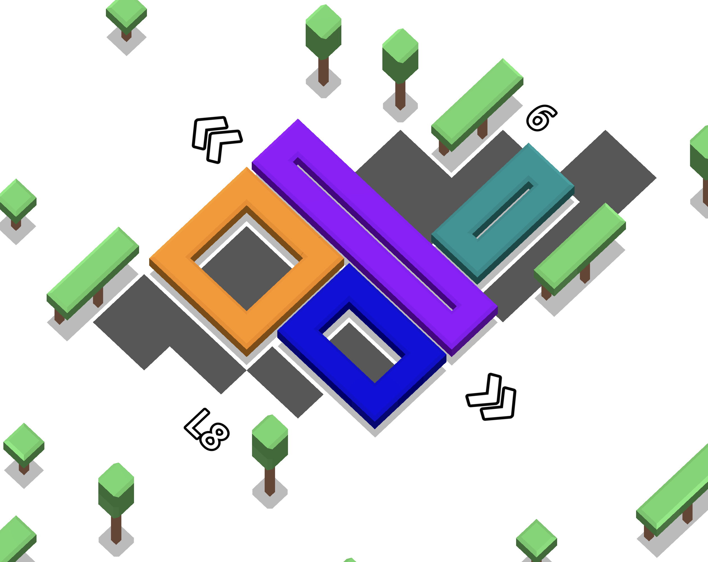

# Loop Stuff

A simple game about placing loops.

Play it here: https://alnis.itch.io/loop-stuff

Drag in the gray areas to place loops. Fill all of the gray tiles to move to the next stage.

The loops must not overlap, and certainly must not be degenerate (i.e. no points or lines allowed!)

The more area you enclose, the higher your score. Consider multiple solutions to find the best one!

Made by Alnis Smidchens (alnis.dev) for the GMTK 2025 Game Jam.

I made all of the art, design, programming, and sound in one day during the jam, with the exception of the music, which I made before the jam.

Made with Godot Engine (godotengine.org)
